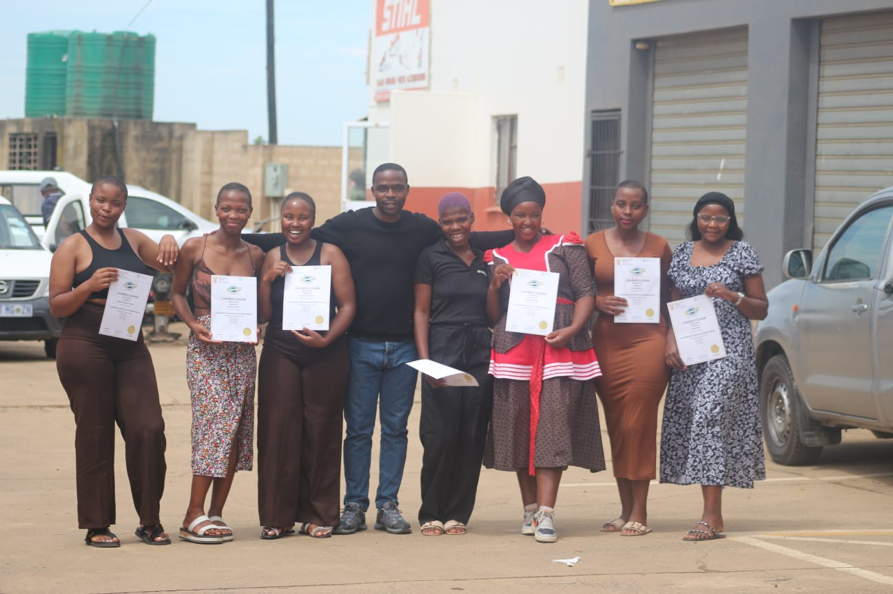
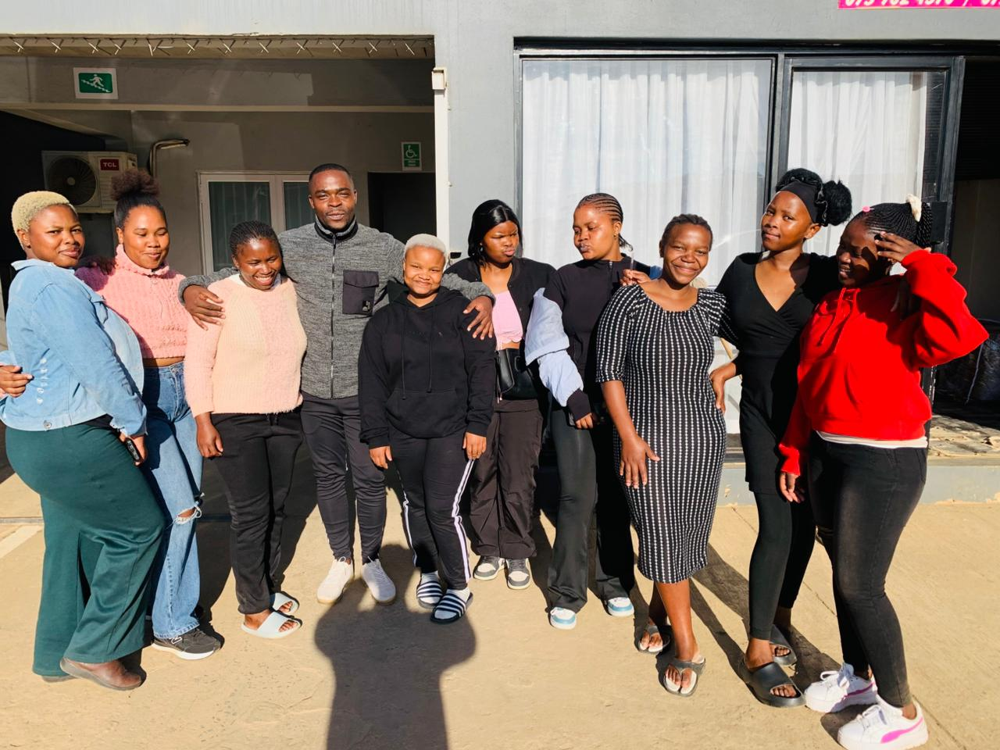
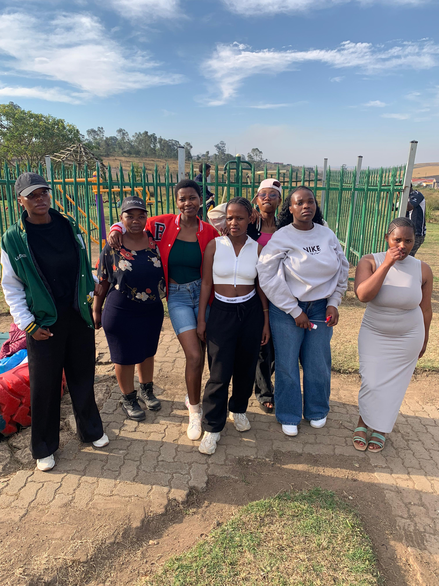

<!-- ANIMATED HEADER -->

 

  

<!-- FEATURED PHOTO -->

## 🎓 Celebrating the Class of 2026

*Another bright chapter begins.* ✨

 

## 🌟 About This Repository

This repository hosts the **official graduation photos** of Akukhanye Private College students who received their **QCTO & SETA accredited certificates** at the **May 2026 graduation ceremony** in Bizana, Eastern Cape.

The photos are displayed on our main website and gallery:

| | |
|---|---|
| 🌐 **Website** | [AkukhanyeSDP.github.io/akukhanye-college](https://AkukhanyeSDP.github.io/akukhanye-college/) |
| 📸 **Gallery** | [AkukhanyeSDP.github.io/akukhanye-photos-May-student-2026-](https://AkukhanyeSDP.github.io/akukhanye-photos-May-student-2026-/) |

## 🖼️ Photo Gallery

<table>
  <tr>
    <td align="center" width="50%">
       
      <b>Graduation Ceremony</b>
    </td>
    <td align="center" width="50%">
       
      <b>Certificate Handover</b>
    </td>
  </tr>
  <tr>
    <td align="center" width="50%">
       
      <b>Celebrating Success</b>
    </td>
    <td align="center" width="50%">
       
      <b>Class of 2026 Group Photo</b>
    </td>
  </tr>
</table>

👉 **[See the full gallery](https://AkukhanyeSDP.github.io/akukhanye-photos-May-student-2026-/)**

## 🏫 About Akukhanye Private College

Akukhanye Private College is a **QCTO & SETA accredited private college** in **Bizana, Eastern Cape, South Africa**, bringing quality further education to local communities.

| 📅 Founded | 🎓 Graduates | 📚 Programmes | ✅ Pass Rate |
|:---:|:---:|:---:|:---:|
| **2010** | **5,200+** | **16+** (NQF 2–5) | **96%** |

**Accreditation:** QCTO · SETA · DHET · POPIA Compliant

### 📖 Programmes Offered

| Programme | Level |
|---|---|
| 📊 Business Management | NQF 5 |
| 💻 ICT Technical Support | NQF 4 |
| 💰 Financial Management | NQF 5 |
| 👶 Early Childhood Development | NQF 4 |
| 🚀 New Venture Creation | NQF 4 |
| ⚙️ Engineering Studies | N1–N3 |
| ☁️ Cloud Administrator | NQF 5 |
| ➕ And more… | [See all](https://AkukhanyeSDP.github.io/akukhanye-college/) |

## 📞 Get in Touch

| | |
|---|---|
| 📍 **Address** | Total Express Building, Erf 517, Main Street, Bizana, 4800, Eastern Cape |
| 📞 **Phone** | [+27 39 251 0118](tel:+27392510118) |
| 📧 **Email** | [info@Akukhanye.co.za](mailto:info@Akukhanye.co.za) |
| 🕐 **Hours** | Monday – Friday, 8:00 AM – 5:00 PM |

## 🔒 Photo Consent & Removal

Graduate photos are published with the consent of the students featured, in line with **POPIA**. If you would like a photo removed, or want a copy of one, please email **[info@Akukhanye.co.za](mailto:info@Akukhanye.co.za)** with your name and the photo filename.

## 📄 License & Usage

© 2010–2026 **Akukhanye Private College**. All rights reserved.
These photos are the property of Akukhanye Private College and may not be reproduced without written permission.

<!-- ANIMATED FOOTER -->

> *"Akukhanya" means "light" in isiXhosa and isiZulu. Our name reflects the light we bring to communities across the Eastern Cape.*

